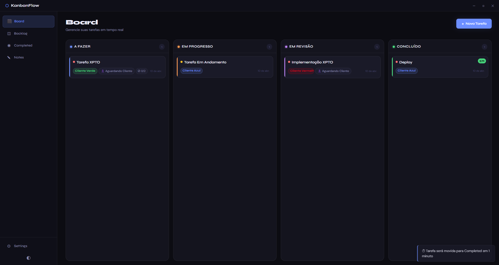
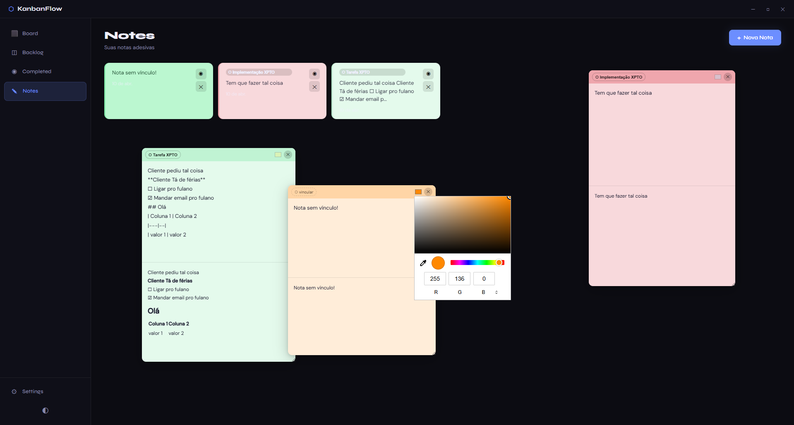
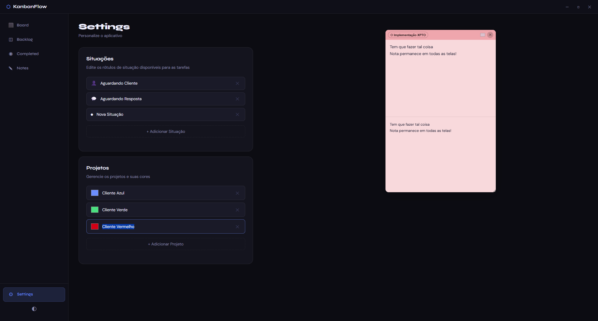

# ⬡ KanbanFlow

> Um organizador de tarefas moderno e elegante baseado em **Kanban**, desenvolvido com **Electron** e **Node.js**.  
> Ideal para gerenciamento pessoal ou de equipes, com suporte a notas adesivas, personalização e armazenamento local.

<p align="center">
  
  
  
</p>

---

## ✨ Funcionalidades

### 🗂️ Gestão de Tarefas
- **Board Kanban** com quatro colunas:
  - A Fazer
  - Em Progresso
  - Em Revisão
  - Concluído
- **Drag & Drop** entre colunas.
- **Backlog** para tarefas sem status definido.
- **Completed** com histórico de tarefas finalizadas.
- **Edição e exclusão** de tarefas.
- **Checklist** interno para subtarefas.
- **Prioridades**: Baixa, Média e Alta.
- **Projetos** com cores personalizadas.
- **Situações** customizáveis com ícones.
- **Timer automático**: tarefas em "Concluído" são movidas para *Completed* após 1 minuto.

### 📝 Sticky Notes com Markdown
- Criação de **notas adesivas flutuantes**.
- **Preview em tempo real** com suporte a **Markdown**.
- **Sanitização de HTML** utilizando **DOMPurify** para maior segurança.
- **Vinculação de notas a tarefas**.
- **Cores personalizadas** ou herdadas do projeto da tarefa vinculada.
- **Arrastar e redimensionar** notas livremente.
- **Persistência de posição e estado** (aberta/fechada).
- **Lista de notas** com pré-visualização do conteúdo.

### 🎨 Personalização
- **Tema Dark/Light** com alternância rápida.
- **Projetos personalizados** com cores.
- **Situações customizáveis** nas configurações.
- Interface moderna e responsiva com tipografia refinada.

### 💾 Armazenamento Local
- Dados salvos localmente em um arquivo **JSON**.
- Nenhuma conexão com a internet é necessária.
- Persistência automática de:
  - Tarefas
  - Configurações
  - Sticky Notes

### 🔒 Segurança
- Uso de `contextIsolation` e `preload.js` para comunicação segura entre processos.
- APIs expostas via `contextBridge`.
- Sanitização de Markdown com **DOMPurify**.
- Sem `nodeIntegration` no renderer.

---

## 🚀 Instalação e Execução

### ✅ Pré-requisitos
- **Node.js** v18 ou superior  
- **npm** (incluso com o Node.js)

### 📦 Passos

```bash
# 1. Clone o repositório
git clone https://github.com/seu-usuario/kanban-flow.git

# 2. Entre na pasta do projeto
cd kanban-flow

# 3. Instale as dependências
npm install

# 4. Execute o aplicativo
npm start
```
---

## 🏗️ Estrutura do Projeto
```
kanban-flow/
├── package.json
├── README.md
└── src/
    ├── main.js          # Processo principal do Electron
    ├── preload.js       # Bridge segura entre Node e Renderer
    ├── index.html       # Interface principal
    ├── app.js           # Lógica da aplicação
    └── styles/
        └── main.css     # Estilos da interface
```
---
## 📁 Armazenamento de Dados

Os dados são armazenados automaticamente na pasta de dados do usuário:

SistemaOperacional | Caminho
|---|--|
Windows	| %APPDATA%/kanban-flow/kanban-data.json
macOS |	~/Library/Application Support/kanban-flow/kanban-data.json
Linux |	~/.config/kanban-flow/kanban-data.json

----
## 🛠️ Tecnologias Utilizadas

Electron – Aplicações desktop multiplataforma
Node.js – Backend e manipulação de arquivos
Marked – Renderização de Markdown
DOMPurify – Sanitização de HTML
HTML5, CSS3 e JavaScript (Vanilla) – Interface e lógica

----

## 📸 Capturas de Tela

Board

Sticky Notes

Settings


---

# 👨‍💻 Autor

Desenvolvido por Davi dos Santos D'Aniello
💼 Desenvolvedor Back-end
🇧🇷-🇮🇹 Rio de Janeiro, Brasil

<p align="center"> Feito com ❤️ usando Electron </p> 